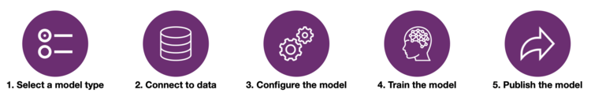

# AI-Builder
AI Builder is a new Power Platform capability that allows you to easily automate processes and predict outcomes to help improve business performance. AI Builder is a turnkey solution that brings the power of AI through a point-and-click experience. Using AI Builder, you can add intelligence to your apps even if you have no coding or data science skills.

## Table of Contents
   [1. Prerequisites](#prerequisites)  
   [2. Audience](#audience)  
   [3. High-Level Flow](#high-level-flow)  
   [4. Supported Scenarios](#supported-scenarios)  
   [5. Course Modules](#course-modules)  
   [6. Resources](#resources)  
   [7. Videos](#videos)  

## 1. Prerequisites
1. Access to [PowerApps](https://powerapps.microsoft.com/en-us/)
2. Create (or be added to) an environment in one of the [supported regions](https://docs.microsoft.com/en-us/ai-builder/administer#supported-regions).  
Note: While in preview, AI Builder is only available in the United States or Europe. AI Builder features will not be available in environments created outside of these regions.
3. Ensure that your account has the Environment Maker role assigned, see [Security in AI Builder](https://docs.microsoft.com/en-us/ai-builder/security) for more details.

<a href="#ai-builder">↥ back to top</a>

## 2. Audience
This course is designed as a beginner course for all skill levels. Basic famililarity with PowerApps will be advantageous. Recommended learning path: [Create a Canvas App in PowerApps](https://docs.microsoft.com/en-us/learn/paths/create-powerapps/).

<a href="#ai-builder">↥ back to top</a>

## 3. High-Level Flow
1. **Select a model type**
Supported scenarios currently include Binary Classification, Form Processing, Object Detection, and Text Classification.

2. **Connect the model to data**
AI Builder can train models based off data that resides within the Common Data Service.

3. **Configure the model**
Follow the point and click model building wizard interface. No coding required.

4. **Train the model**
This is an automated process handled by the AI Builder service, based on the previously provided inputs.

5. **Publish and use the model**
As an example, there are special AI Builder components available within PowerApps such as a Form Processor or Object Detector. These objects can be connected to a published model.

  

<a href="#ai-builder">↥ back to top</a>

## 4. Supported Scenarios
  

**Binary Classification**  
An AI model that classifies elements of a given data set into two distinct groups by understanding historical data patterns with historical outcomes. Use this AI model for any business questions that can be answered in one of two options (e.g. yes/no, pass/fail, go/no-go). Use cases: Fraud/Not Fraud, Credit Approved/Credit Declined, Customer Churn/Not Churn, etc.

 

**Text Classification**  
The process of automatically tagging text entries by learning from previously labeled text items. This enables us to classify unstructured text data stored in the Common Data Service with meaningful business categories. Use cases: Call analytics, feedback processing, content categorization, etc.

  

**Object Detection**  
This model is able to detect instances of objects that appear within digital images.  In order for the model to learn, you must collate a sample of images which contain the objects we are trying to detect. Use cases: Quality Control, Inventory Management, Automation, etc.

  

**Form Processing**  
An AI model that uses machine learning to extract key-value pairs and table data from form documents. After the model has been trained, you can elect which specific pieces of information need to be retrieved. Use cases: Registration Forms, Work Orders, Invoices, etc.

<a href="#ai-builder">↥ back to top</a>

## 5. Course Modules
* Lab 1 - [Form Processing](labs/lab-form-processing.md)
* Lab 2 - Object Detection
* Lab 3 - Binary Classification
* Lab 4 - Text Classification

<a href="#ai-builder">↥ back to top</a>

## 6. Resources
* [AI Builder - Announcement](https://powerapps.microsoft.com/en-us/blog/introducing-ai-builder-for-powerplatform/)
* [AI Builder - Documentation](https://docs.microsoft.com/en-us/ai-builder/overview)
* [AI Builder - Labs](https://aka.ms/ai-builder-labs)
* [AI Builder - Forum](https://powerusers.microsoft.com/t5/forums/filteredbylabelpage/board-id/PowerAppsForum1/label-name/ai%20builder)
* [AI Builder for Microsoft PowerApps](https://aka.ms/PowerApps_AIBuilder)
* [AI Builder for Microsoft Flow](https://aka.ms/Flow_AIBuilder)  

<a href="#ai-builder">↥ back to top</a>

## 7. Videos
**General**  
* [AI Builder is now available](https://www.youtube.com/watch?v=WSWmn7WM3i4)

**Microsoft Business Applications Summit 2019 (June 10-11, Atlanta - Georgia)**  
* [Introducing AI Builder](https://www.youtube.com/watch?v=JOt_mXqVxFI)
* [Learn how to add AI to the Power Platform to solve business problems](https://www.youtube.com/watch?v=E1be_J1qxro)

**Microsoft Inspire 2019 (July 14-18, Las Vegas - Nevada)**  
* [Empowering Citizen Developers with AI Builder](https://www.youtube.com/watch?v=IA8aRy_WM4s)
* [AI Builder: Adding Intelligence to the Power Platform](https://myinspire.microsoft.com/sessions/546b0ac7-a254-45a6-b322-6720d23f9a56)

<a href="#ai-builder">↥ back to top</a>

